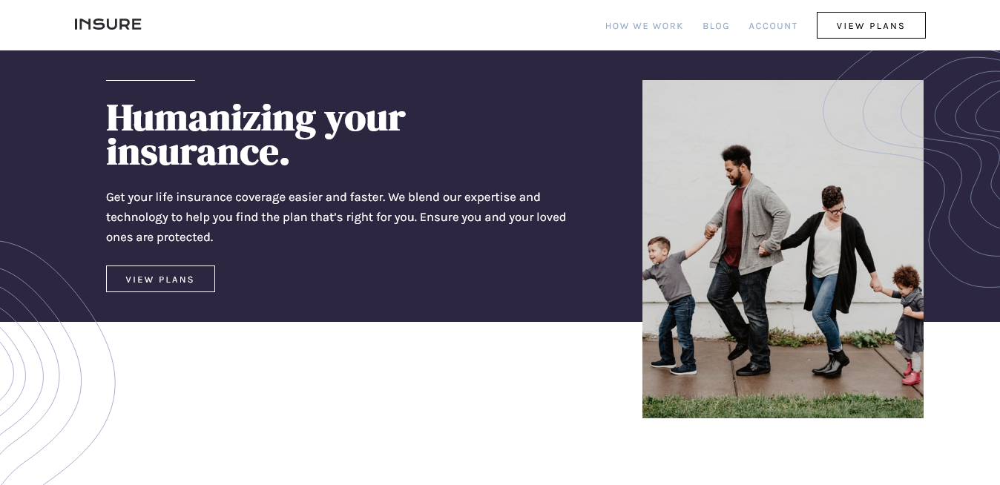

# Frontend Mentor - Insure landing page solution

This is a solution to the [Insure landing page challenge on Frontend Mentor](https://www.frontendmentor.io/challenges/insure-landing-page-uTU68JV8). Frontend Mentor challenges help you improve your coding skills by building realistic projects. 

## Table of contents

- [Overview](#overview)
  - [The challenge](#the-challenge)
  - [Screenshot](#screenshot)
  - [Links](#links)
- [My process](#my-process)
  - [Built with](#built-with)
  - [Continued development](#continued-development)
- [Author](#author)

## Overview

### The challenge

Users should be able to:

- View the optimal layout for the site depending on their device's screen size
- See hover states for all interactive elements on the page

### Screenshot

Screenshot of desktop solution. 

Screenshot of mobile solution.

### Links

- Solution URL: [https://github.com/ChinyangaTL/insure-landing-page](https://github.com/ChinyangaTL/insure-landing-page)
- Live Site URL: [https://chinyangatl.github.io/insure-landing-page](https://chinyangatl.github.io/insure-landing-page)

## My process

Challanged myself to build within an hour and no more. Time elapsed before I could make the mobile side 100%. Oh well...

### Built with

- Semantic HTML5 markup
- CSS custom properties
- Flexbox
- CSS Grid
- Javascript

### Continued development

Slight bug where it breaks at around 400px which is a shame. Perhaps I really should adopt a mobile first workflow.

## Author

- Github - [Github](https://www.your-site.com)
- Frontend Mentor - [@beyonce-beytwice](https://www.frontendmentor.io/profile/beyonce-beytwice)
